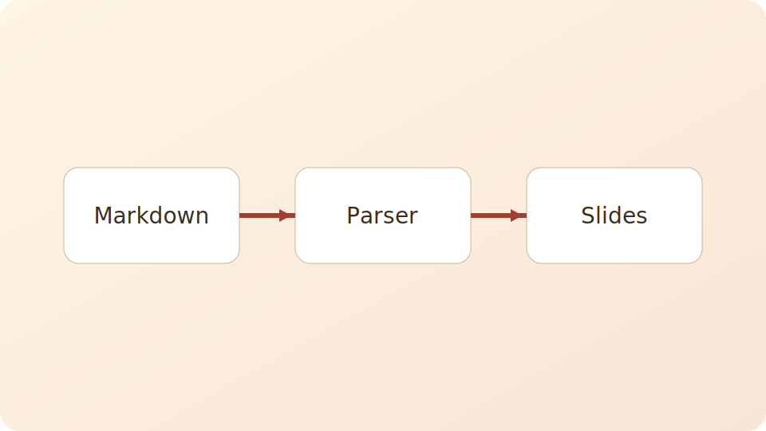

# Markdownスライドサンプル
- author: 山田 太郎
- organization: Example Corp.
- position: Product Manager
- date: 2026-02-24
- footer: Example Corp. Internal

このファイルは、Markdownスライドビューアで使える記法例をまとめたサンプルです。

## はじめに
このサンプルでは、見出し・箇条書き・表・画像の表示例を確認できます。

### スライドの作り方（基本）
- `#` : タイトルスライド
- `##` : 1ページのタイトル
- `###` 以降 : ページ内の小見出し

## 箇条書きの例
### 点付きリスト
- 重要なポイントを短く並べる
- 1行はなるべく短くする
- 強調したい内容から順に並べる

### 番号付きリスト
1. 背景を説明する
2. 要点を示す
3. 次のアクションを決める

## 表の例
| 項目 | 内容 | 備考 |
|---|---|---|
| タイトルスライド | `#` 見出し | 先頭の1つを使用 |
| ページ区切り | `##` 見出し | 1ページごと |
| ページ内見出し | `###` 見出し | 任意 |
| 共通フッター | `- footer:` | タイトルスライド内 |

## 文章レイアウトの例
### 短い説明文
閲覧者に伝えたい内容は、1ページに1テーマでまとめると読みやすくなります。

### 補足
画像や表を使う場合は、本文を短めにするとスライド全体のバランスが取りやすくなります。

## 画像1枚の例
画像はキャプション（altテキスト）付きで表示できます。

## 画像2枚の例
同じページに複数画像を置く例です。

## 画像3枚の例
キャプションの有無や文言の長さも確認できます。

## 画像4枚の例
小さめの図を並べて一覧表示する例です。

## まとめ
### このサンプルで確認できること
- タイトルスライドのメタ情報表示
- 箇条書き、表、文章の表示
- 画像1〜4枚のレイアウト
- キャプション表示
